# How to Create an Externally Accessible Static Website using an Azure Virtual Machine and Cl

In this guide, we will create an externally accessible static website using an Azure Virtual Machine (VM) running Ubuntu. We will set up a network security group to allow HTTP access, connect to the VM via SSH, install an Apache web server, and serve a static HTML file from a Git repository. Additionally, i will set up Azure Front Door to manage and optimize web traffic. Below are the steps in detail.

## Create an Externally Accessible Static Website using Azure Virtual Machine

### Prerequisites
- Azure Subscription
- Basic knowledge of Azure Portal and Linux

## Step-by-Step Guide

### Step 1: Create an Externally Accessible Virtual Machine

1. **Log in to the Azure Portal:**
   Log in with your Azure account.

2. **Create a New Virtual Machine:**
   - In the left-hand menu, select **"Create a resource"**.
   - Search for **"Virtual Machine"**.
   - Click on **"Create"**.

3. **Configure the Virtual Machine:**
   - **Subscription:** Select your Azure subscription.
   - **Resource group:** Create a new resource group or select an existing one.
   - **Virtual machine name:** Enter a name for your VM.
   - **Region:** Select a region close to you.
   - **Availability options:** No infrastructure redundancy required.
   - **Image:** Ubuntu Server 20.04 LTS (latest version).
   - **Size:** Select an appropriate size.
   - **Authentication type:** SSH public key.
   - **Username:** Enter a username.
   - **SSH public key:** Generate new ssh key.
   - **Inbound port rules:** Allow selected port > **SSH (22)**.

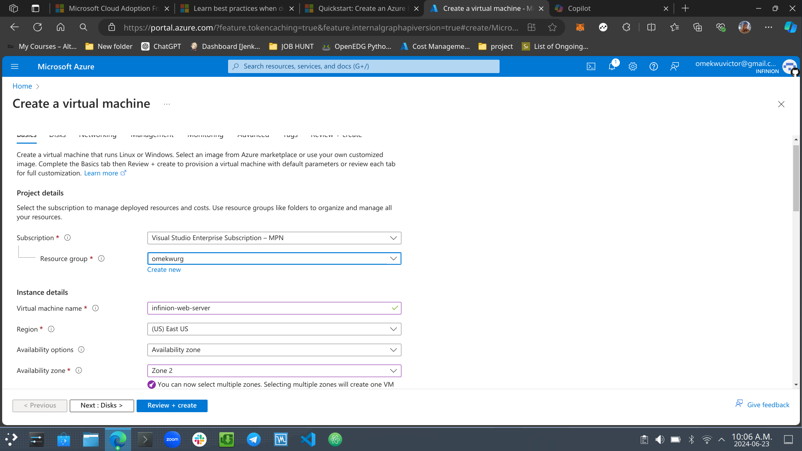

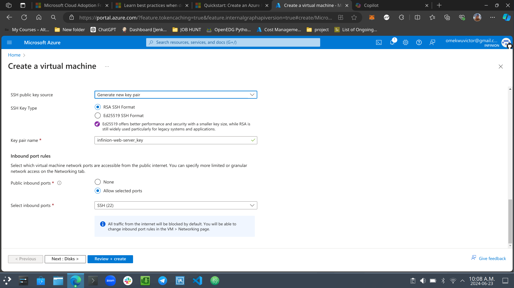

4. **Review + Create**
   - Review the settings and click on "Create".

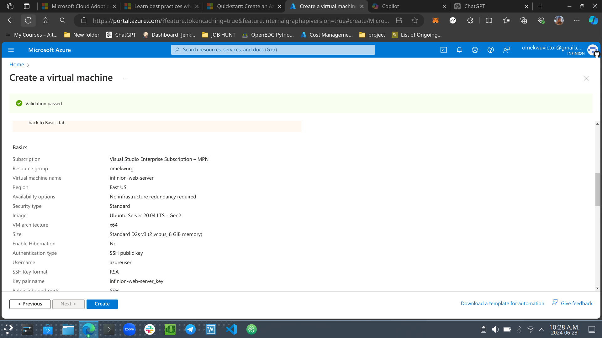

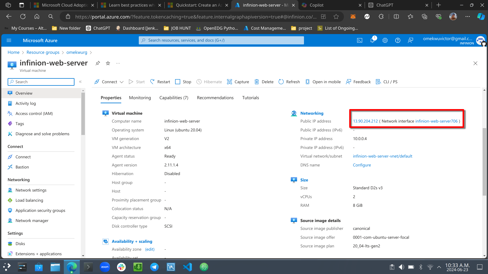

   **"Virtual machine resources created"**
   - 

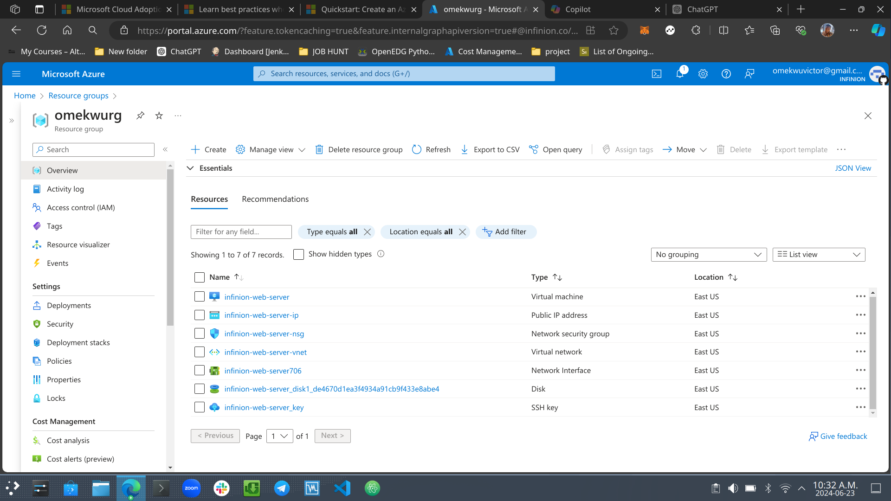

### Step 2: Configure the Network Security Group

1. **Navigate to the Network Settings:**
   - Go to the **"VM"** and select the network settings you created.

   **Add an Inbound Security Rule for HTTP:**
   - Click on **"Inbound security rules"**.
   - Click on **"Add"**.
   - **Source:** Any.
   - **Source port ranges:** *.
   - **Destination:** Any.
   - **Destination port ranges:** 80.
   - **Protocol:** TCP.
   - **Action:** Allow.
   - **Priority:** 310.
   - **Name:** Allow-HTTP.

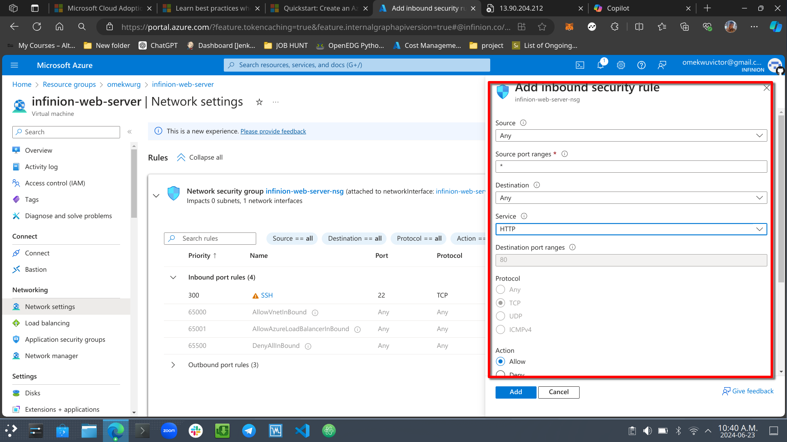

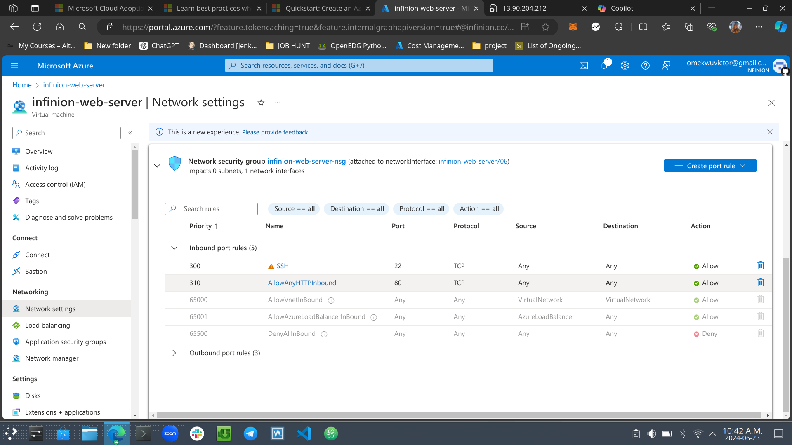

### Step 3: Connect to the Virtual Machine via Native SSH

1. **Open an SSH client (Termina):**
   - For Linux, open Terminal

2. **Connect to the VM:**
   - Locate the Dir where the ssh key file is stored.
   - Chmod 400 the the ssh key file to give only the owner read access.

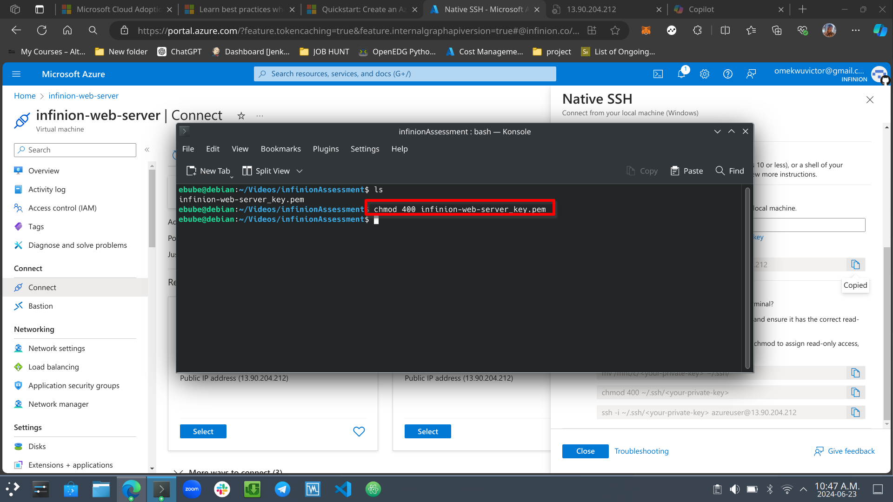

### Step 3b: SSH into the VM and Install Apache

1. **Connect to the VM**
   - Use an SSH client to connect to your VM.

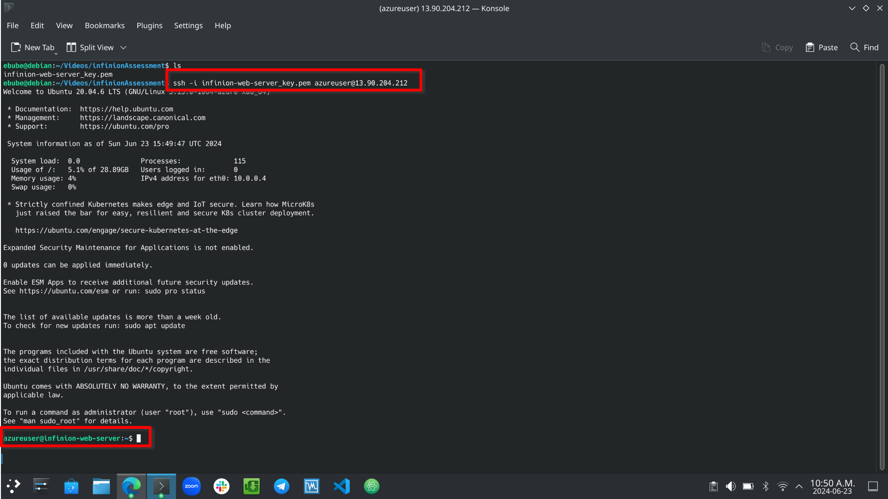

2. **Update the Package List and Install Apache**

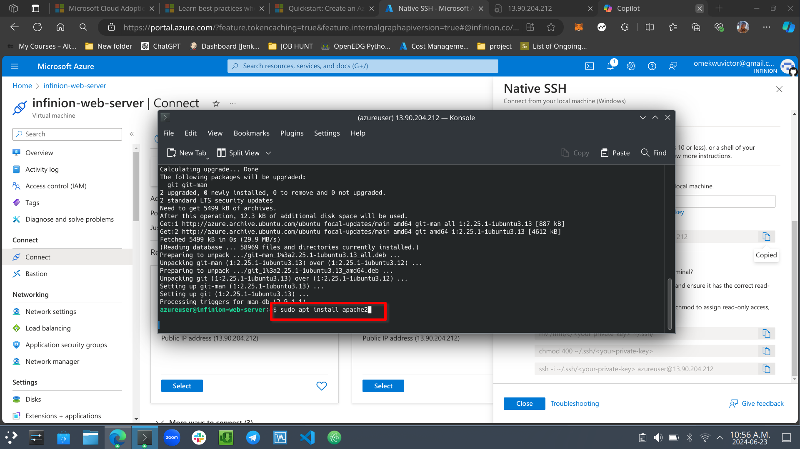

4. **Enable and Start Apache Service**
  
  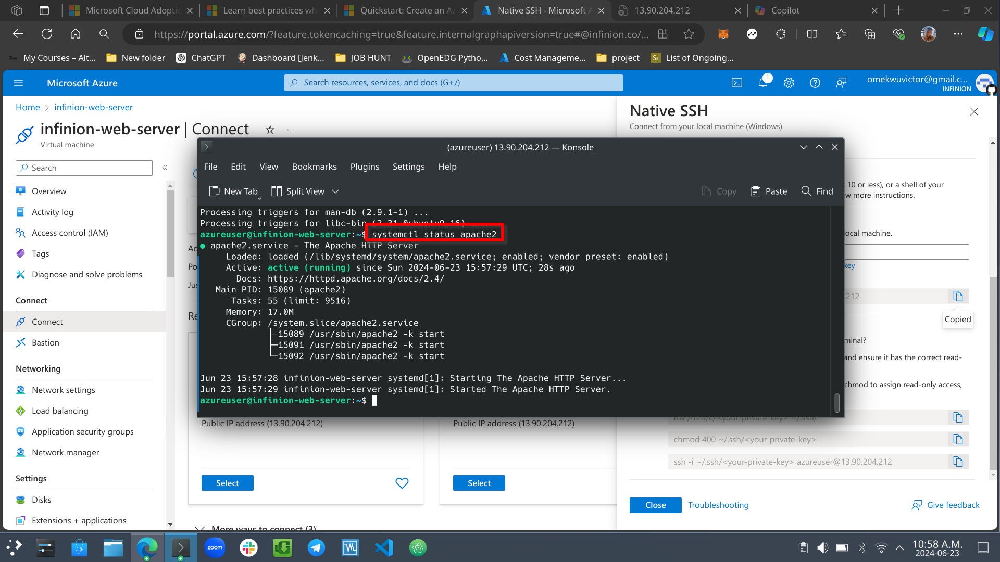

### Step 3c: Clone the Repository and Update the Default Page

1. **Install Git**

   Use the command to install git: sudo apt install git

2. **Clone the Repository**
  
   Clone the github repo which contains the new index.html file (wepage)

3. **Update Apache Default Page**
    Navigate to the Apache root directory and change the html file to the new index.html file from the github repo.
     
    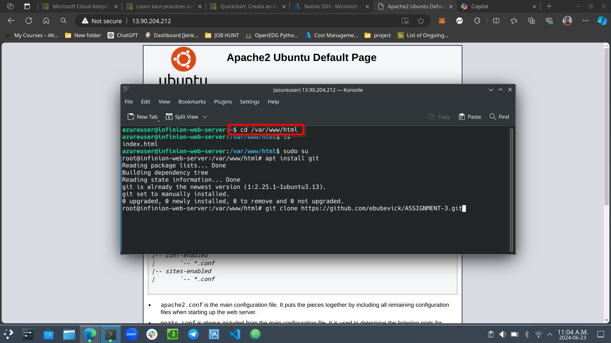

4. **Verify the Website** 
   **Open a Web Browser:**
   - Enter the public IP address of your VM to see the Apache default page replaced  by the `index.html` file from the repository.

   - Webpage before the change

    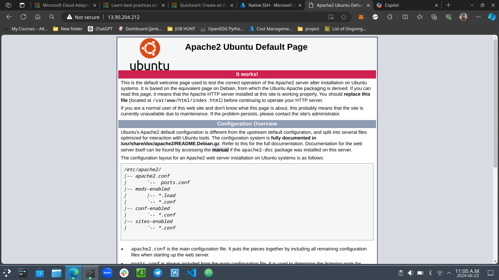

   - Webpage after the change 

   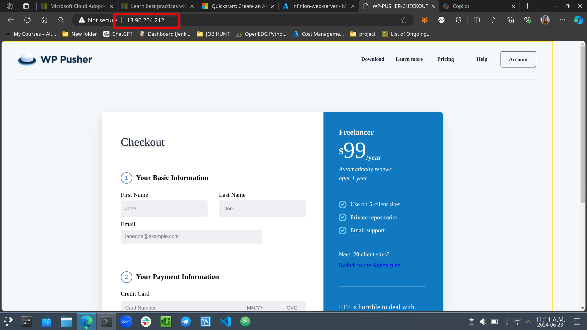

### Step 4: Set up Azure Front Door

    Now to set up the Front Door to manage and optimize the web traffic to the webpage.

1. **Create a Front Door**
   - In the Azure Portal, go to "Create a resource" and search for "Front Door".
   - Click "Create" and follow the wizard to set up your Front Door.
     - **Frontend/domains**: Add a frontend domain.
     - **Backend pools**: Add your VM's public IP as a backend.
     - **Routing rules**: Create a rule to route traffic from the frontend to the backend.

     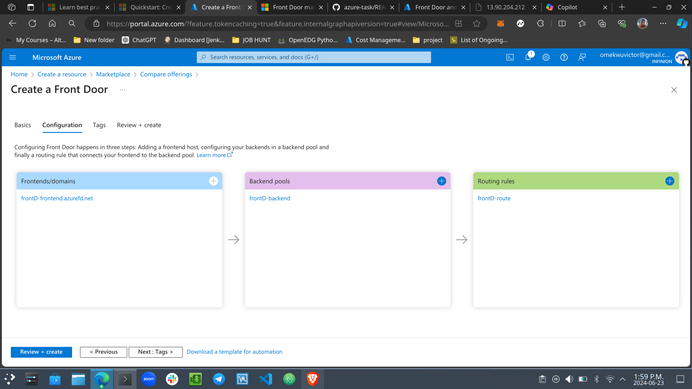

2. **Configure Front Door**
   - Ensure that your Front Door configuration points to the public IP of your VM and that it handles HTTP traffic.

   - Front Door Configuration:
    - Click "Add a frontend host".
        Frontend host name: Enter a unique name. This will be your Front Door URL (e.g., myfrontend.azurefd.net).
        Click "Add".
    
    - Click "Add a backend pool".
        Backend pool name: Enter a name for your backend pool.
        Backend: Click "Add a backend".
            Backend host type: Select "Custom host".
            Backend host name: Enter the public IP address or DNS name of your virtual machine.
            Priority: Set to 1.
            Weight: Set to 50.
            HTTP Port: 80.
            HTTPS Port: 443 (optional, if you have HTTPS enabled on your VM).
            Click "Add".
            Click "Add" to save the backend pool.
    
    - Click "Add a routing rule".
        Routing rule name: Enter a name for your routing rule.
        Accepted protocols: Select "HTTP" (and "HTTPS" if applicable).
        Frontend hosts: Select the frontend host you created earlier.
        Backend pool: Select the backend pool you created earlier.
        Click "Add".
        
    - Click "Review + create" and then "Create".

   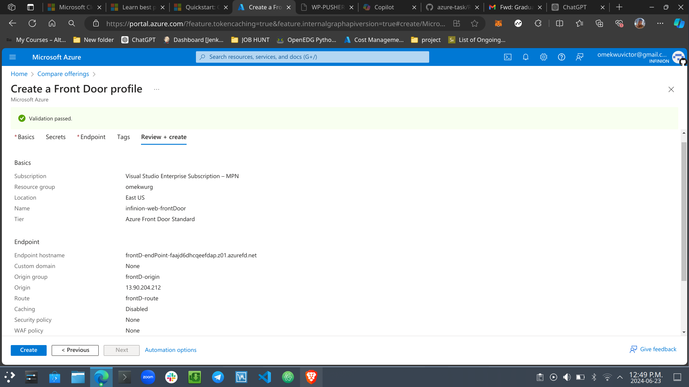

### Step 4b: Verify the Setup for FrontDoor

1. **Test Front Door**
   - Navigate to the Front Door URL to verify that the traffic is correctly routed to your VM.

   

### Conclusion

- Challenge faced: DNS propagation.
- Successfully created an externally accessible static website using an Azure Virtual Machine with Apache, cloned a repository to replace the default page, and set up Azure Front Door for better traffic management.